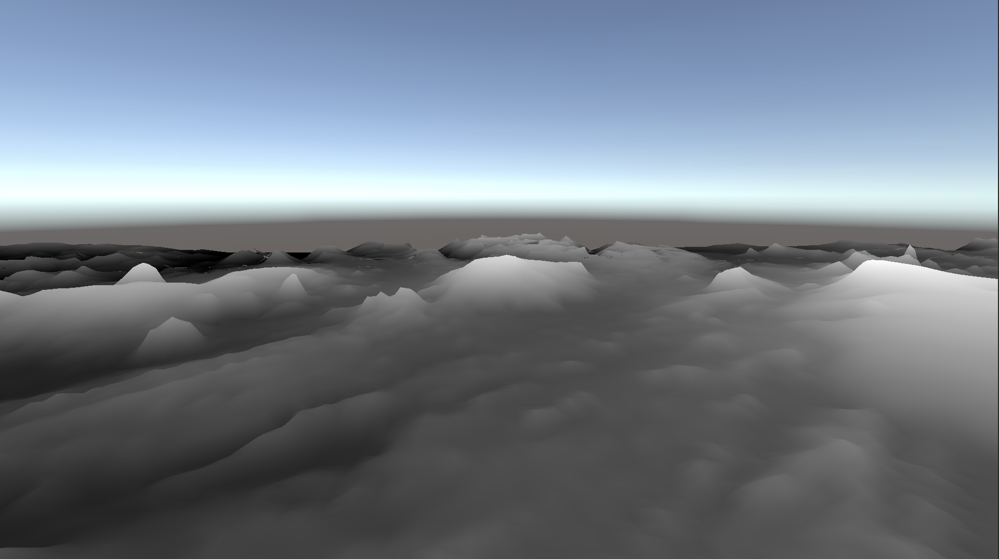

Terrain Tessellation
================

Use Unity3D to implement the terrain tessellation shader. 

The original OpenGL implementation - https://learnopengl.com/Guest-Articles/2021/Tessellation/Tessellation

